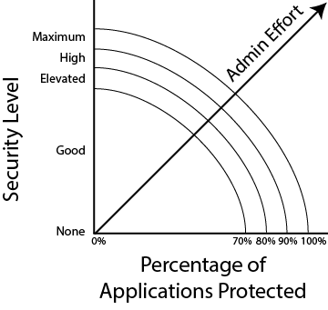

# &nbsp;&nbsp;f5-app-sec
[](https://travis-ci.com/ArtiomL/f5-app-sec)
[](https://github.com/ArtiomL/f5-app-sec/releases)
[](https://github.com/ArtiomL/f5-app-sec/commits/master)
[](https://github.com/ArtiomL/f5-app-sec/graphs/code-frequency)
[](https://github.com/ArtiomL/f5-app-sec/issues)
[](/LICENSE)
[](https://f5cloudsolutions.herokuapp.com)

&nbsp;&nbsp;

## Table of Contents
- [Description](#description)


Just a list of items / tasks for now:  

Based on the following article:  
https://support.f5.com/csp/article/K07359270

<p align="center"></p>


Good WAF Security, Getting started with ASM:  
https://clouddocs.f5.com/training/community/waf/html/class3/class3.html

Elevating ASM Protection:  
https://clouddocs.f5.com/training/community/waf/html/class4/class4.html

High and Maximum Security:  
https://clouddocs.f5.com/training/community/waf/html/class5/class5.html

WAF Programmability:  
https://clouddocs.f5.com/training/community/waf/html/class6/class6.html

- [ ] F5 Hardening script

- [ ] ASM Policies Audit Tool  
  
- [ ] ASM YouTube Videos  
  
- [ ] ASM Word Doc to RtD
  
- [ ] Upload actual ASM policies for each level  

- [ ] WAF Questionnaire

- [ ] ASM Operations Guide

- [ ] 2018 Application Protection Report

- [ ] F5 University ASM training (for Partners)

- [ ] Super-NetOps (Class3?)

&nbsp;&nbsp;

```
docker run -dit --rm -p 443:8443 artioml/f5-app-sec
```
